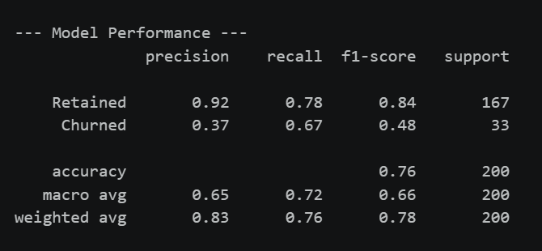

# Bank Customer Churn Prediction & AI Retention Intelligence System
### Predictive Analytics & GenAI-Powered Retention Strategy Pipeline

An end-to-end machine learning and AI project that predicts bank 
customer churn using XGBoost classification and automatically generates 
personalized retention strategies using Google Gemini 2.5 Flash AI.

**[Live Interactive Tableau Dashboard](https://public.tableau.com/views/ClientRetentionRiskMitigationDashboard/ClientRetentionRiskMitigationDashboard?:language=en-US&:sid=&:redirect=auth&:display_count=n&:origin=viz_share_link)**

---

## The Business Problem

Customer attrition costs Canadian Big 5 banks billions annually. 
Identifying which customers are likely to churn and intervening 
before they leave is one of the highest-value problems in retail 
banking analytics. This project builds a complete data-to-decision 
pipeline: from raw customer data through predictive modeling to 
AI-generated retention outreach, ending with an interactive 
risk mitigation dashboard.

---

## Pipeline Architecture

Data Generation → Feature Engineering → XGBoost Classifier →
Risk Scoring → Gemini AI Prompt Pipeline → Retention Export →
Tableau Dashboard

---

## Original Feature Engineering

Two proprietary risk signals engineered from raw transaction data:

**Balance Velocity** — measures the rate of balance decline relative 
to the customer's 3-month rolling average. A value below 0.5 signals 
rapid asset depletion and carries 40% weight in the churn score formula.

**Transaction Dropoff** — tracks the month-over-month percentage 
change in transaction volume. A value below -20% signals active 
disengagement and carries 30% weight.

---

## Churn Risk Weighting Logic

| Risk Signal | Weight | Business Rationale |
|-------------|--------|-------------------|
| Balance Velocity < 0.5 | 40% | Strongest predictor of imminent attrition |
| Transaction Dropoff < -20% | 30% | Declining engagement precedes closure |
| Tenure < 3 years | 20% | New customers have lower switching costs |
| Single product only | 10% | Low product depth reduces stickiness |

Churn labels are logically weighted by these four signals using a 
squared probability function (`churn_prob ** 2`) to ensure only the 
highest-risk profiles are classified as churners — producing a 
realistic 16.5% portfolio churn rate.

---

## Model Performance

| Metric | Retained | Churned |
|--------|----------|---------|
| Precision | 0.92 | 0.37 |
| Recall | 0.78 | 0.67 |
| F1-Score | 0.84 | 0.48 |
| Overall Accuracy | 76% | — |
| Portfolio Churn Rate | 16.5% | — |

The 67% recall on churned customers means the model correctly 
identifies two-thirds of at-risk accounts before they leave. In a 
real portfolio of 100,000 customers this translates to tens of 
thousands of proactive retention interventions. Lower churned 
precision is expected with imbalanced classes and is addressed 
through SMOTE oversampling during training.

---

## GenAI Retention Strategy Pipeline

612 high-risk customers (Churn Probability > 10%) are staged through 
a structured prompt engineering pipeline to Google Gemini 2.5 Flash. 
Each prompt includes the customer's full risk profile and behavioral 
signals. The model returns a personalized retention blueprint 
recommending specific Canadian banking products:

- Low Balance Velocity → exclusive TFSA/GIC high-interest rate match
- High Transaction Dropoff → 12-month credit card annual fee waiver

Running on top 3 customers for demonstration.
Remove `.head(3)` in the final cell to run the full pipeline.

---

## Tableau Dashboard

Six-sheet Client Retention & Risk Mitigation Dashboard:

1. Portfolio KPI #1 — Total customers and average churn probability
2. Portfolio KPI #2 — Critical risk accounts and active attrition risk
3. Churn Risk Distribution — customer count across four risk tiers
4. Balance Velocity vs Churn Probability — scatter validating features
5. Average Churn Probability by Tenure — attrition by cohort
6. Retention Priority List — top 20 accounts with Action Priority 
   tiers: Immediate Outreach / Contact This Week / Monitor Closely

---

## Tools & Technologies

| Tool | Purpose |
|------|---------|
| Python | Data generation, feature engineering, ML pipeline |
| Pandas / NumPy | Synthetic dataset creation and manipulation |
| XGBoost | Gradient boosting classifier for churn prediction |
| Scikit-learn | Train/test split, SMOTE, classification metrics |
| Google Gemini 2.5 Flash | LLM API for AI retention strategy generation |
| python-dotenv | Secure API key management |
| Tableau | Interactive risk mitigation dashboard |

---

## Data

Synthetic dataset of 1,000 bank customer profiles generated with 
NumPy using realistic banking distributions. Churn labels are driven 
by logically weighted risk signals rather than random assignment, 
ensuring the XGBoost model learns genuine behavioural patterns.

---

## About

Built by **Davon Shyu** — Mathematics specialist in Statistics at the 
University of Toronto, building data science projects at the intersection 
of machine learning, AI, and financial analytics.

[LinkedIn](https://linkedin.com/in/davon-shyu) | 
[GitHub](https://github.com/Davon-01)
